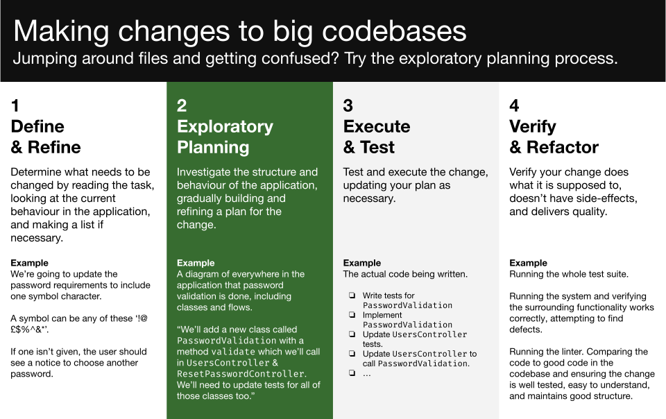

# Realistic System: Android (with Kotlin)

_Coaching this? Read the coach guidance [here.](https://github.com/makersacademy/slug/blob/main/materials/universe/realistic_systems/kotlin)_

This module is to help you learn to make changes in a realistic software system.
A 'realistic' system means that it is complex enough that you can't understand
it in depth before you start working on it. To make changes to it, you need to
gain some important engineering skills. We will frame these skills through the
process of the **Exploratory Planning Process**.

In this module you will work on a realistic software system using iOS. You will first do some investigation exercises to learn
about the system, and then move on to working on small tickets. A coach will
guide you throughout.

This work may require a significant change in your approach to making software.
It will likely feel significantly slower than you are used to. This doesn't
signal that you are doing a bad job — but a difference in the kind of work you
are doing.

As you gain these skills, you will be able to work in any system, no matter how
complex — a key ability on the road to mid-level.

## Exploratory Planning

We will use the **Exploratory Planning Process** to structure our changes this
week. This process helps you scale your skills beyond the simple case and make
progress in a complex system.

[(PDF Version)](images/exploratory-planning-process.pdf)

## The System

You'll work on the [Wikipedia Android project](https://github.com/wikimedia/apps-android-wikipedia). This is a well maintained open source project, with a range of features and complexities which we'll spend time understanding, and then making changes to. 

### How to get set up

1. Make sure your installation of Android Studio is up to date. This project should be compatible with the latest version.
2. Navigate to [this fork](https://github.com/makersacademy/apps-android-wikipedia) of the Wikipedia repository, and clone it. We're going to work from a shared repository over the next two weeks. 

## Investigation Exercises

For diagrams, use something other people can see and refer to rather than a bit
of paper. For example, [draw.io](https://draw.io/), [diagram.codes](https://www.diagram.codes), [wireframe.cc](https://wireframe.cc) or [miro.com](https://miro.com/).

### Challenge 1

#### Objectives
- Install, build and run the project

#### How should I get the project running? 

Have a look at the official documentation [here](https://www.mediawiki.org/wiki/Wikimedia_Apps/Team/Android/App_hacking). Once you've run the scripts, you'll be able to open the project in Android Studio. Hit Run and give the project some time to Build - this may take a few minutes. 

Success for this challenge is the successful launch of the app in Simulator - is it launching and responsive to user interaction? 

If you haven't already, you'll need to make an Android Simulator. It's recommended to use a Pixel 2 with the recommended OS (API 31, Android 12.0)

### Challenge 2
#### Objectives
- Investigate and explain with the use of diagramming the flow of execution from launching the app to displaying the Onboarding page

When the user launches the app, they're first shown the Onboarding page. Run the project in Simulator, and without navigating away from the Onboarding page or carrying out any other user interactions, investigate and describe the full flow of execution. 

Android Studio Developer Tools will be of use in exploring this flow - specifically the use of Debug View Hierarchy and adding print statements and breakpoints. 

Sequence diagrams can support with understanding and describing the flow of execution. 

Some points you should consider in your research:
- Can you trace the order in which the code runs? How do we get from the app launching into this onboarding page. Where can I find the onboarding page's source code ?
- Which debugging tools are useful for following the flow? 

### Challenge 3
#### Objectives
- Investigate and diagram the flow of a failing test. 

Run the existing tests in the project. Are they all passing? 

Let's hone in on one test in particular for this challenge, to learn about the flow of this project. First, identify the failing test. 

Try to gather relevant information about the failing test. Consider how your investigations could vary depending on who you'll present your findings to - consider three different hierarchies of context, one for each of: 
1. A business analyst - the highest level explanation of what the test is for, and why it might be failing
2. Another developer in your pod - describe the failing test in slightly more detail, as if you and another developer were to set out on making it pass. Can you get visibility over where the bug is? 
2. A technical lead on your project, responsible for overseeing the technical progress of multiple development pods across the team. Is there anything else this failing test could impact? Does it concern any other pods? 

Context we should consider here is:
- Of what relevance to each of these parties the failing test is
- What level of detail each of these parties will need to know about the failing test

Depending on the team member, some information you might aim to capture and describe about the failing test is: 
- What is the purpose of the test? 
- What is the expected input and output of the method under test? 
- What is your understanding of the code being run by this test? 
- The flow of execution on running this test - diagramming can be of use here (try a sequence diagram). 
- How could you understand and describe the network calls and data structures being used here? 
- Why do you think the test is failing?

Bonus: Once you've identified the cause of the failing test, try to get it passing. Consider what changes may be within your current remit - the source of the bug, or the test itself. 

### Challenge 4

Objective: Investigate and diagram behaviour of methods influenced by `Activity` Lifecycle. 

- Choose one of the main `Activity`s in the app, one of: `CategoryActivity`, `BaseActivity`, `AboutActivity`, or `ContributionsActivity`
- Identify the `Activity` methods affected by the lifecycle
- Write a sentence or two about what each method is doing for this particular `Activity` - this will require some research into what these methods are usually responsible for 
- Create a flow chart to represent the lifecycle methods in your chosen `Activity`: represent the order in which each method is called when the feature is used by the user, and include your descriptions of their responsibilities next to each method
- To do this, you can make use of breakpoints and print statements

<!--
## Tickets

/**

  Put together a list of tickets here for the devs to work through. 
  
  For a two week module, 2-3 blocks of 4 tickets will more than suffice. You can
  group them by theme or difficulty.
  
  Ideally there should be a mixture of very small and small-to-medium type
  changes. Don't be tempted to put a big one in here as it could be a big derail
  — if they're ready for it, the coach will be able to improvise.

**/
-->